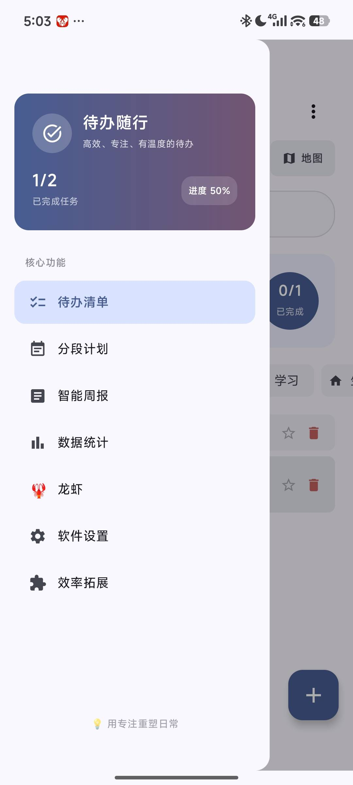
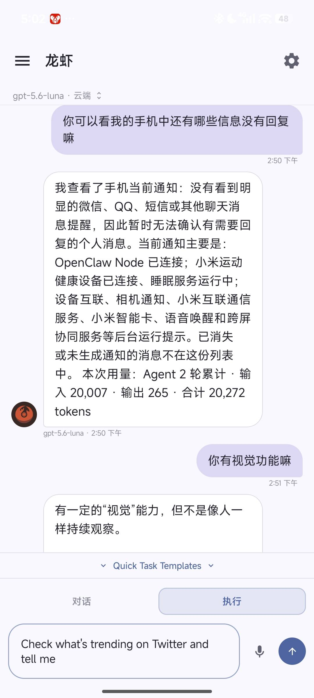

# PokeClaw TodoList: Smart Productivity & Mobile Automation Agent Suite
### 智能待办与设备自动化代理套件 (PokeClaw TodoList)

---

[**English Version**](#english-documentation) | [**中文文档**](#中文说明文档)

---

# English Documentation

Welcome to **PokeClaw TodoList**, an advanced Android productivity workspace and autonomous mobile automation ecosystem. The repository couples a modern Jetpack Compose Todo Client (`app`) with a background Accessibility Service-based Automation Agent (`pokeclaw-agent`).

---

## 📸 Screenshots & Previews

  
  &nbsp;&nbsp;
  

---

## 1. Core Architecture & Modules

The workspace is structured into two Gradle modules:

### 📱 `app` — Jetpack Compose Todo & AI Productivity Client

1. **AI-Driven Goal Breakdown & Planning**
   * **Natural Goal Parsing**: Powered by Gemini LLM integration (`GeminiManager`), converting natural language prompts into structured sub-task checklists, categories, geographic locations, and cover art parameters.
   * **Automated Weekly Report**: Analyzes completed tasks across customized date ranges to draft structured, professional workplace weekly summaries (`AnalysisScreen`).
   * **Multi-Tier Model Fallback Sequence**: Built-in fallback mechanism (`gemini-3.5-flash` $\rightarrow$ `gemini-3.1-flash-lite-preview` $\rightarrow$ `gemini-2.5-flash`) ensuring high availability and seamless concurrency.

2. **Baidu Map Geographic Task Linkage**
   * **Two-Way Coordinate Mapping**: Binds tasks directly to geographical coordinates (`BaiduTodoMapView`, `BaiduMapPickerView`).
   * **Synchronized List-Map Carousel**: Scrolling through the task list smoothly animates and centers the map camera on task markers; clicking a map marker automatically highlights the task card.
   * **Marker Clustering & Dynamic Bounds**: Automatically groups dense clusters of task pins and adjusts the map viewport.

3. **Canvas Vector Art Generator & Audio Synthesizer**
   * **Procedural Canvas Covers**: Calculates vector geometry coordinates to draw custom geometric art (circles, rectangles, stars, triangles, line patterns) directly on the Android Canvas, saved as task covers offline.
   * **AI Music & Chord Synthesizer**: Generates chord progressions, lyrics, and synthesizes MIDI-style multi-pitch melodies via `AudioSynthPlayer`.

4. **Productivity & Time Management Tools**
   * **Foreground Pomodoro Timer**: Integrated 25/5-minute focus timer backed by a Foreground Service (`PomodoroForegroundService`) with live status-bar countdown notifications and audio prompts.
   * **Native Home Screen Widgets**: Android App Widgets (`TodoAppWidgetProvider`) for quick task inspection and check-off directly from the Android desktop.
   * **Daily Rollover Tracker**: Manages uncompleted tasks across days (`DailyTodoSnapshot`) with candidate recommendations.
   * **System Calendar & Alarm Synchronization**: One-click native Android Calendar and Alarm Clock scheduling for tasks with deadlines.
   * **Modern Fluid Themes**: Features 5 curated color themes (Cosmic Blue, Forest Green, Sakura Pink, Aurora Cyan, Sunset Red) supporting Standard and Compact UI modes.

---

### 🤖 `pokeclaw-agent` — Autonomous Mobile Automation Agent

1. **3-Tier Routing Pipeline (`PipelineRouter`)**
   * **Tier 1: Deterministic Engine (`TaskParser`)** (0 LLM Calls, <1s latency): Regex-matched direct execution for Android Intents (phone calls, alarms, timers, settings, URLs) and direct actions (screenshot, back, home, app launch).
   * **Tier 1.5 / 2: Skill Workflows (`SkillRegistry`)**: Parameterized multi-step skill workflows with graceful fallback to Tier 3 on failure.
   * **Tier 2: LLM Classifier (`TaskClassifier`)**: Single short LLM call (~200-word prompt) to route complex or ambiguous user requests.
   * **Tier 3: Autonomous ReAct Loop (`DefaultAgentService`)**: Multi-step perception-reasoning-action loop supporting Cloud LLMs or local LiteRT (Gemma) models.

2. **Token-Efficient UI Perception & Device Control (`ClawAccessibilityService`)**
   * **Low-Token Screen Layout Tree (`getScreenTree`)**: Converts raw `AccessibilityNodeInfo` tree hierarchies into a ultra-compact text UI representation (e.g., `[n1] "WhatsApp" tap edit (500,300)`).
   * **Complete Gesture Engine**: Coordinates tap, node-based tap (`tap_node`), long press, swipe, incremental scroll-to-find (`scroll_to_find`), text injection, and screenshot capture.

3. **Performance & Token Optimization**
   * **Opt-2 Screen Pre-Warming**: Automatically attaches layout hierarchy to the initial LLM prompt for task-oriented queries, saving 1 reasoning turn.
   * **Opt-3 Auto-Attach Screen**: Automatically captures layout hierarchy and text diffs 500ms after executing an action tool, saving 3–5 seconds per turn.
   * **Dynamic History Compression**: Retains only the latest layout tree while compacting legacy tool outputs, saving up to 50% in input tokens.

4. **Safety Guards & Loop Detection**
   * **5-Signal 3-Level StuckDetector**: Monitors 5 loop signals (same action, unchanged screen, zero text diff, high repetition, repeated errors) with a 3-level escalation mechanism (`HINT` $\rightarrow$ `STRATEGY_SWITCH` $\rightarrow$ `AUTO_KILL`).
   * **Semantic Guard Interceptors**: `DirectDeviceDataGuard`, `InAppSearchGuard`, and `EmailComposeGuard` block LLM text hallucination and prevent premature task termination.
   * **Token Budget Monitor (`TaskBudget`)**: Tracks token usage and estimated cost with soft warnings and hard stops.

5. **Knowledge Vault & Multi-Channel Ecosystem**
   * **Local Markdown Vault (`KBManager`)**: Provides `kb_read`, `kb_write`, `kb_search`, `kb_append`, and `kb_add_todo` for local MD note and Todo management.
   * **Multi-Channel Integration (`ChannelManager`)**: Supports message reception and status updates across external channels (WeChat, Telegram, Lark, etc.).
   * **Android TV Integration**: Specialized D-pad navigation, volume, menu, and power key tools for TV devices.
   * **Floating Bubble Controller (`FloatingCircleManager`)**: Live floating status bubble displaying agent steps, token consumption, and cost estimates.

---

## 2. Versioning & Subscriptions

### 🏷️ Current Release
* **Version Name**: `1.22`
* **Version Code**: `23`
* **Min SDK**: `28` (Android 9.0 Pie)
* **Target SDK**: `36` (Android 15+)

### 🔔 Update Subscriptions
PokeClaw TodoList features integrated update checking:
* **Automatic Checks**: Checks daily in the background via GitHub API (`https://api.github.com/repos/agents-io/PokeClaw/releases/latest`).
* **Manual Subscriptions**: Click **Watch** on our GitHub Repository page and select **Custom -> Releases** to receive release alerts.

---

## 3. Changelog & Key Highlights

### 🚀 v1.22 (Current Version)
* **Fallback Model Chain**: Implemented fallback configurations in `GeminiManager` (`gemini-3.5-flash` $\rightarrow$ `gemini-3.1-flash-lite-preview` $\rightarrow$ `gemini-2.5-flash`).
* **Auto-Attach Screen (Opt-3)**: Automatically captures layout diffs post-action, saving 1 reasoning turn per action.
* **History Compression Algorithm**: Compacts legacy screen trees and tool outputs, saving up to 50% input tokens.
* **Stuck Detector Upgrades**: Multi-signal rolling window detection with HINT, STRATEGY_SWITCH, and AUTO_KILL levels.

---

## 4. Run Locally

### Prerequisites
* [Android Studio](https://developer.android.com/studio) (Koala or later recommended)
* Android Emulator or physical device running Android 9.0+

### Steps
1. **Clone & Open**: Open Android Studio, select **Open**, and choose this directory.
2. **Gradle Sync**: Allow the IDE to sync and download dependencies.
3. **API Key Setup**: Create `.env` in the root directory and add keys: `GEMINI_API_KEY=your_key_here`.
4. **Run**: Click **Run 'app'** (`Shift + F10`) to deploy.

---
---

# 中文说明文档

欢迎使用 **PokeClaw TodoList**。本项目是一个结合了现代待办规划（Todo Client）与自主无障碍控制代理（Accessibility Automation Agent）的智能 Android 效率应用套件。

---

## 📸 界面展示与示例

  
  &nbsp;&nbsp;
  

---

## 1. 详细功能特性介绍

项目通过 Gradle 模块化拆分为两大核心部分：

### 📱 `app` — Jetpack Compose 待办与 AI 效率客户端

1. **AI 智能规划与任务拆解**
   * **自然语言智能拆解**：基于 Gemini 大模型自动解析用户目标，结构化输出分类、子任务清单、地理选址坐标及插图生成参数。
   * **职场周报自动生成**：内置分析屏 (`AnalysisScreen`)，自动分析过去一周/一月的已完成事项，提炼结构化职场周报。
   * **模型容灾降级链**：内置自动降级序列（`gemini-3.5-flash` $\rightarrow$ `gemini-3.1-flash-lite-preview` $\rightarrow$ `gemini-2.5-flash`），确保高并发下服务的可用性。

2. **百度地图地理位置深度联动**
   * **双向坐标绑定**：支持将待办项绑定至地理坐标，在地图上直观标注 (`BaiduTodoMapView`, `BaiduMapPickerView`)。
   * **列表与地图卡片同步流**：待办列表滚动时，地图镜头平滑聚焦至对应标记；点击地图标点，列表自动滚动并高亮对应待办卡片。
   * **标点聚合与镜头视角缩放**：自动聚合高密度邻近标点，智能计算最佳显示视角。

3. **Canvas 几何艺术画与 AI 作曲合成器**
   * **Canvas 矢量几何插图**：由 AI 计算坐标点，直接在 Android Canvas 画布上绘制各种矢量的几何艺术图（圆、方、星、三角、线纹），可离线生成存为待办封面。
   * **AI 音乐合成器**：由 AI 创作歌词、和弦与音高序列，通过 `AudioSynthPlayer` 音频合成器直接播放 MIDI 风格的和弦旋律。

4. **效率与时间管理套件**
   * **番茄钟前台服务**：25/5 分钟专注计时，Backed by 前台服务 (`PomodoroForegroundService`)，支持状态栏实时倒计时与音效提醒。
   * **桌面原生 App Widget**：桌面小组件 (`TodoAppWidgetProvider`)，无需打开 App 即可直接在手机桌面查看并勾选今日待办。
   * **跨天留转与快照追踪**：支持未完成任务每日跨天留转（Rollover），并在 `DailyTodoSnapshot` 中追踪历史留转记录。
   * **系统日历与闹钟同步**：一键将带截止时间的待办事项同步至 Android 原生 Calendar 与 Alarm 闹钟。
   * **多款现代主题**：内置 5 款色彩主题（太空蓝、森林绿、樱花粉、极光青、夕阳红），支持标准模式与紧凑模式（Compact）。

---

### 🤖 `pokeclaw-agent` — 无障碍自主控制代理套件

1. **三级分流路由 Pipeline (`PipelineRouter`)**
   * **Tier 1 确定性引擎 (`TaskParser`)**（0 LLM 消耗，<1s 响应）：通过正则表达式直接拦截并执行拨号、闹钟、倒计时、设置/URL跳转、截图、物理按键等操作。
   * **Tier 1.5 / 2 预设 Skill 工作流 (`SkillRegistry`)**：参数化高频流程，失败时平滑降级到 Tier 3 Agent 循环。
   * **Tier 2 LLM 任务分类器 (`TaskClassifier`)**：单次极短 Prompt 请求快速分类。
   * **Tier 3 ReAct 自主 Agent 循环 (`DefaultAgentService`)**：多轮感知-推理-工具调用循环，支持 Cloud 模型与端侧 LiteRT (Gemma) 模型。

2. **低 Token UI 感知与无障碍操控 (`ClawAccessibilityService`)**
   * **极简纯文本 UI 树 (`getScreenTree`)**：自动过滤无用节点，生成低 Token 文本 UI 树（如 `[n1] "微信" tap edit (500,300)`）。
   * **完整的底层手势**：支持坐标点击、节点点击 (`tap_node`)、长按、滑动、增量寻找 (`scroll_to_find`)、文本注入与截图。

3. **高性能与 Token 节约机制**
   * **Opt-2 屏幕预热**：任务型 Prompt 首轮直接附带最新屏幕结构，节省 1 轮推理。
   * **Opt-3 动作自动带屏**：执行 Action 工具后自动静默等待 500ms 并抓取最新屏幕，**每轮省去 3-5 秒专门感知时间**。
   * **历史上下文动态压缩**：全局仅保留最后一份完整屏幕树，较旧的工具返回压缩为精简摘要，**节省高达 50% 输入 Token**。

4. **死循环防护与安全 Guard**
   * **5-信号 3-级别 StuckDetector**：监控 5 种死循环信号，实施 `HINT` $\rightarrow$ `STRATEGY_SWITCH` $\rightarrow$ `AUTO_KILL` 梯级容错。
   * **语义拦截器 (Guards)**：`DirectDeviceDataGuard` / `InAppSearchGuard` / `EmailComposeGuard` 防幻觉，拦截未调工具直接回复“完成”的假完成行为。
   * **Token 预算监控 (`TaskBudget`)**：实费与 Token 软硬双重保护。

5. **本地知识库 Vault 与多通道/多端支持**
   * **本地 Markdown 知识库 (`KBManager`)**：包含 `kb_read`, `kb_write`, `kb_search`, `kb_append`, `kb_add_todo` 工具，管理本地 MD 文件与 Todo 清单。
   * **多渠道接入 (`ChannelManager`)**：支持微信、Telegram、飞书等通道静默接收任务与回传结果。
   * **Android TV 端适配**：支持 D-Pad 方向键、确认键、音量与电源键控制。
   * **桌面悬浮球 (`FloatingCircleManager`)**：实时展示当前 Agent 执行步数、已用 Token、预估成本及任务状态。

---

## 2. 版本与更新订阅

### 🏷️ 当前版本
* **版本名称**: `1.22`
* **版本代码**: `23`
* **最低支持 API**: `28` (Android 9.0)
* **目标 API**: `36` (Android 15+)

### 🔔 更新订阅与获取
PokeClaw TodoList 内部集成了自动更新监测：
* **自动检查**：每天会在后台静默访问 GitHub Releases 接口 (`https://api.github.com/repos/agents-io/PokeClaw/releases/latest`)，若有新版本弹窗提示。
* **手动订阅**：建议在 GitHub 项目主页点击 **Watch** 并勾选 **Custom -> Releases** 选项。

---

## 3. 历史更新日志 (Changelog)

### 🚀 v1.22 (当前版本)
* **备用模型容灾链**：在 `GeminiManager` 中加入降级模型序列（`gemini-3.5-flash` $\rightarrow$ `gemini-3.1-flash-lite-preview` $\rightarrow$ `gemini-2.5-flash`）。
* **自动附加屏幕状态 (Opt-3)**：在执行点击、输入、打开 App 等“动作类工具”后自动静默等待 500ms 并抓取最新屏幕，每步节省 1 个推理回合。
* **历史 Token 压缩算法**：合并冗余的历史屏幕结构，压缩非最近轮次的工具返回结果，大幅节省 Prompt 占用。
* **防卡死策略升级**：优化 StuckDetector 策略，新增 Level 1 (HINT) 到 Level 3 (AUTO_KILL) 梯级容错。

---

## 4. 本地运行步骤

### 运行环境准备
* 安装最新版的 [Android Studio](https://developer.android.com/studio)
* 准备 Android 9.0 及以上版本的真机或模拟器

### 步骤
1. **导入项目**：打开 Android Studio，选择 **Open** 并指向本目录。
2. **同步构建**：等待 Gradle 完成依赖包拉取和配置。
3. **配置 API 密钥**：在根目录下创建 `.env` 文件并添加：`GEMINI_API_KEY=你的API_KEY`。
4. **开始运行**：点击 **Run 'app'** (`Shift + F10`) 部署到设备。
